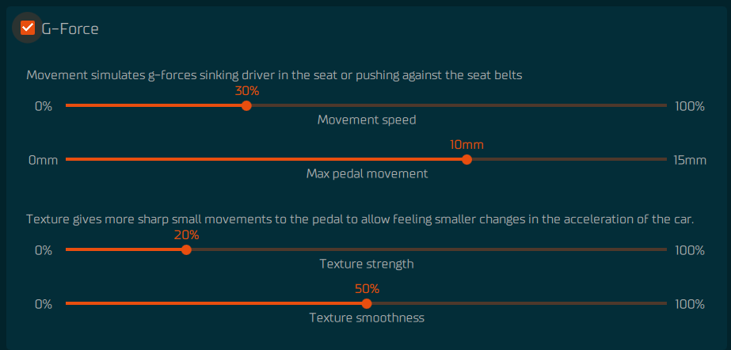

The effects use telemetry from a simulator to create different kinds of effects. The effects have limited simulator support but the support will keep increasing as the time goes on. See [Game setup](games/index.md) for complete list of supported games and effects, and required steps to enable the telemetry support from the game.

## Motor vibration

Motor vibration is a vibration effect which frequency changes based on car RPM.

- Frequency multiplier: Used to change the vibration frequency range.
- Intensity: Used to adjust how powerful the vibration is.
- Low and high RPM balance: Used to the change the intensity based on RPM.

## ABS

ABS effect simulates brake ABS feeling when ABS activates.

- Frequency: Frequency of ABS pulses when ABS activates.
- Intensity: Used to adjust how powerful the ABS effect is.
- Smoothness: Used to adjust how coarse the effect feels.

## Traction control

Traction control activation can be felt, when this effect is enabled.

- Frequency: Frequency of pulses when traction control activates.
- Intensity: Used to adjust how powerful the effect is.

## G-force

The effect simulates feeling of G-forces pushing the driver towards the seat belts and the pedals during braking and the sinking in the seat when accelerating.

The effect has two sides, the movement and the texture. The movement is slow adjustment of the pedals position that causes the main feeling of the g-forces. The texture side provides small sharper effects that react to shorter changes in the acceleration of the car like switching gears or colliding.

Movement speed controls how quickly movement effect reaches the maximum pedal movement. Increasing it will provide shorter and sharper effect. Max pedal movement specifies how much the pedal position can differ from its normal position based on the force curve and other pedal feel adjustments.
