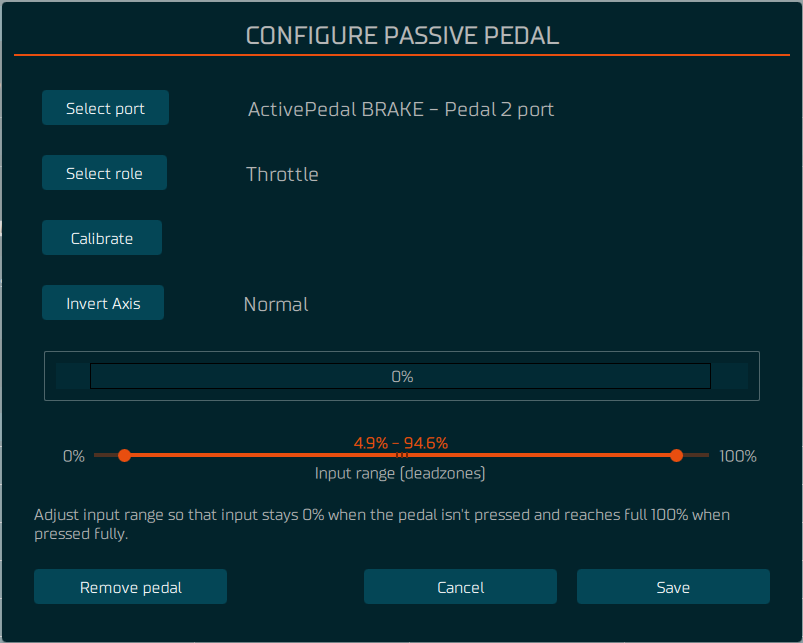
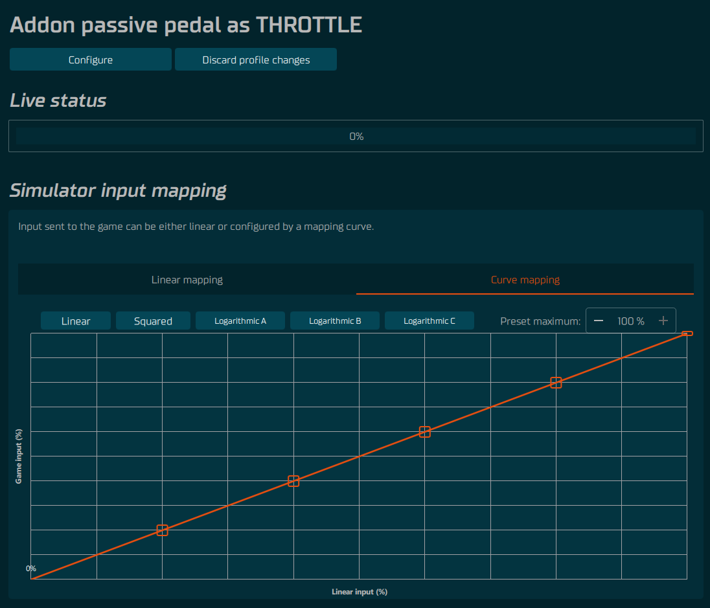

Passive pedals can be used with an ActivePedal. To use external pedals connected to ActivePedal they need to be added as a device to Tuner.

## Adding passive pedal

To add passive pedal, press Add device -button found on bottom left corner of the Tuner and select "Passive pedal". Now a new device is seen on a device panel. The device has not been configured and therefore it shows yellow circle (not configured). Press the passive pedal on the device panel.

## Initial configuration and calibration

On a passive pedal configure view select to which port the passive pedal is connected (1 or 2) and select pedal role: brake, throttle or clutch. 

To calibrate the passive pedal, press the calibrate button. Then fully press the passive pedal and release it a few times. This way the range of the pedal is recorded. After this is done, press ok. Invert axis if needed.

Then input range slider becomes visible, which allows finer adjustment of dead zones so that the pedal input stays 0% when the pedal isn't pressed and also always reaches full 100% input, when pressed. Monitor the indicator above the slider to see that the dead zones are suitable and then save the configuration.

## Passive pedal input mapping

The normal profile view of the passive pedal shows the current game input level as large slider.
By default the input from the pedal is linearly sent to the game so the sensor value maps 1:1 to the game input. Optionally curve mapping can be enable that will allow creating non-linear mapping to the game.

Vertical axis is the input sent to the game and the horizontal axis the linear input from the sensor.
