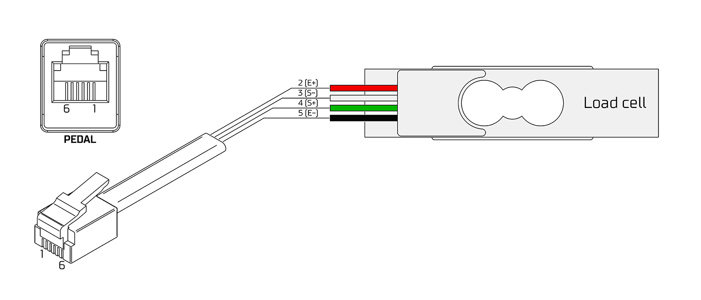
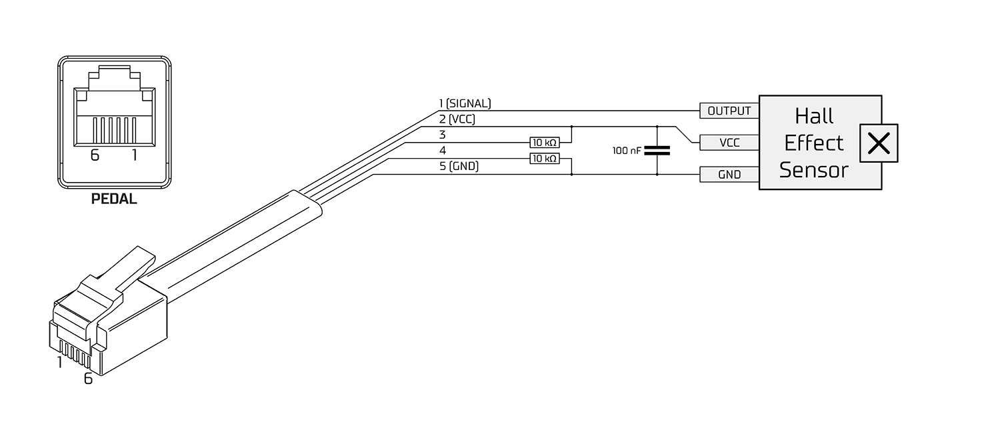

## Passive pedal port

Simucube ActivePedal has two integrated load cell amplifiers and analog voltage inputs. The ports labeled as PEDAL 1 and PEDAL 2 support de-facto standard 4-wire *load cell* pedals and *hall effect sensor* based pedals. The load cell circuit has been optimized for typical 1 kOhm load cells.

Connector type for the passive pedal ports is a 6 pin *RJ12 6P6C* connector.

Note: Do not connect pin 6 (cable shield) to pin 5 (GND).

Note: Observe the maximum allowed total current consumption of 30 mA which means the limit is split over both of the ports, eg. one pedal can use 30 mA or two pedals 15 mA per pedal if they were to be identical. Consuming too much current will effect the behaviour of external pedals. For example the current consumption of a typical 1 kOhm load cell with 5 V supply voltage is 5 mA (I = U/R = 5 V / 1000 ohm = 0.005 A).

Note: These ports are not meant for any external lighting as current limit of the ports is easily exceeded, use only for low power pedal sensors.

### Connecting a load cell

| Pin | Load cell wiring, typical color scheme  |
| --- | --------------------------------------- |
| 1   | (not connected)                         |
| 2   | E+ (red)                                |
| 3   | S- (white)                              |
| 4   | S+ (green)                              |
| 5   | E- (black)                              |
| 6   | Optional cable shield (not connected elsewhere) |

Colors represent a typical coloring scheme of 4-wire load cells, but it is not guaranteed. Always check the datasheet from the manufacturer if possible. Wiring a load cell incorrectly will not cause any harm, only incorrect measurements. When correctly connected, applying force to the measurement direction of the load cell will cause the measured value to rise.

### Connecting a hall effect sensor

Hall effect sensor output type has to be analog voltage and has to be rated to withstand supply voltage of 5 VDC.

| Pin | Hall effect sensor wiring                            |
| --- | ---------------------------------------------------- |
| 1   | Sensor signal (0-5 VDC)                              |
| 2   | Sensor positive supply voltage (5 VDC, 30 mA max)    |
| 3   | Connect this pin through a 10 kOhm resistor to pin 2 |
| 4   | Connect this pin through a 10 kOhm resistor to pin 5 |
| 5   | Sensor negative supply voltage (GND)                 |
| 6   | Optional cable shield (not connected elsewhere)      |

